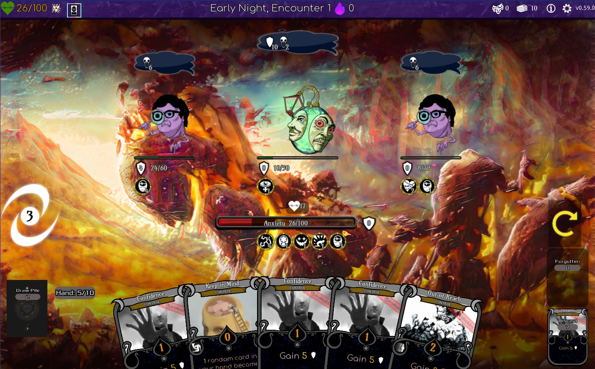
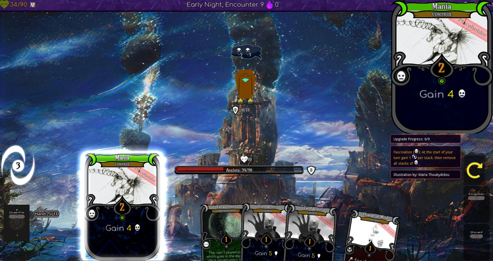
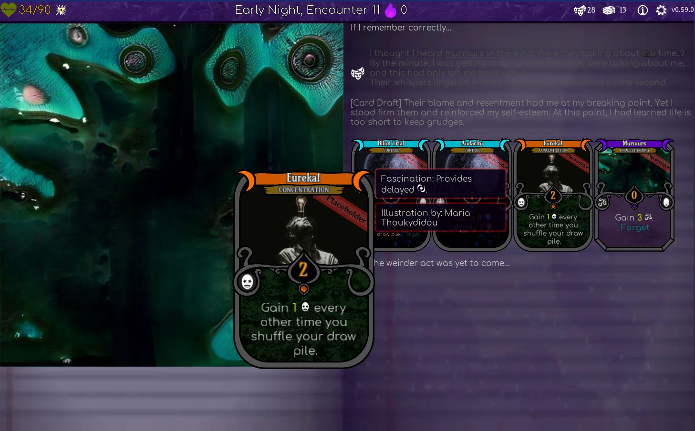
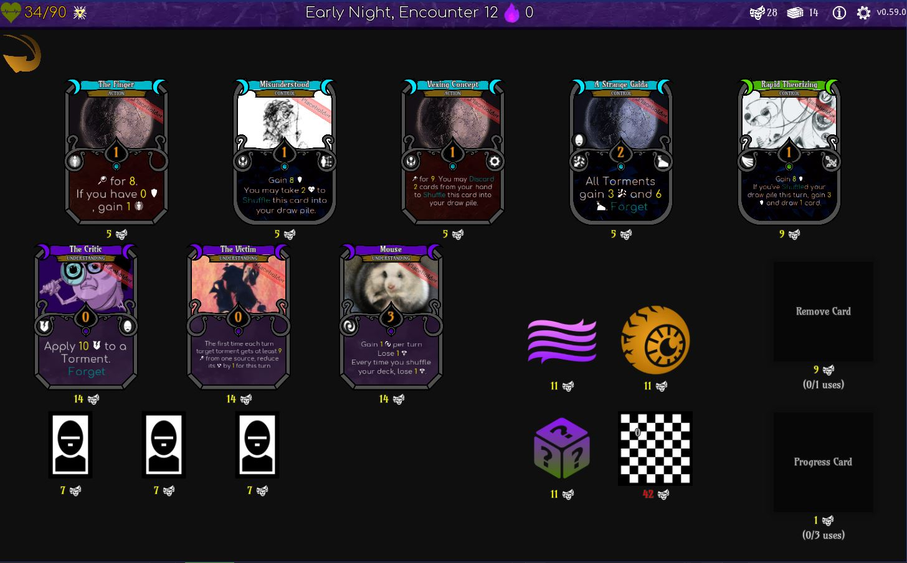
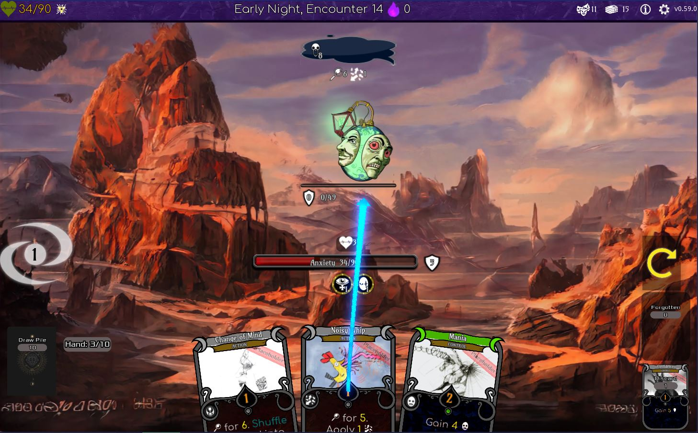
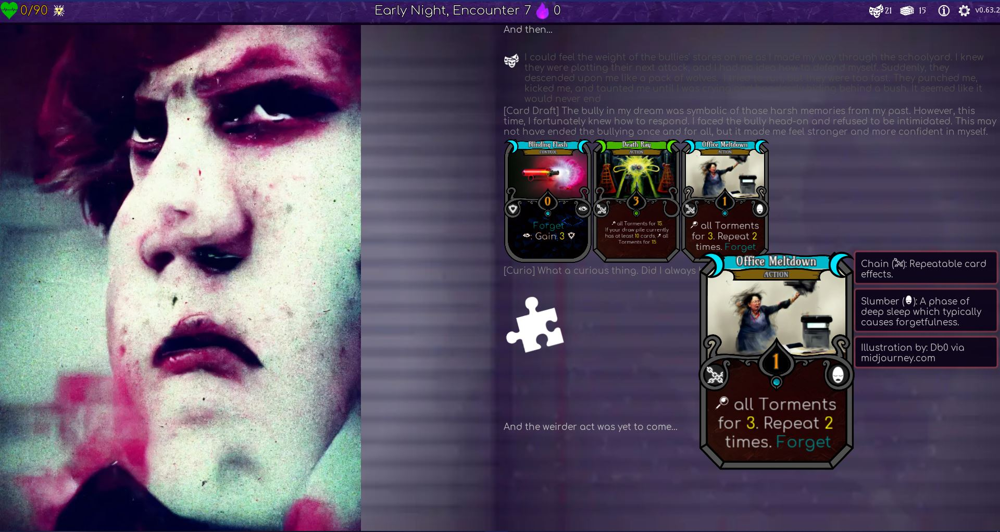
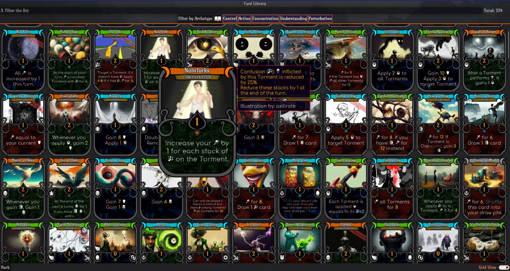

# Hypnagonia: Therapy through Nightmares [v0.66.0](CHANGELOG.md)

Hypnagonia is a 'spire-like' deckbuilder card game where you take the part of a dreamer captured in a nightmare realm in their recurring dreams and struggling to overcome their own issues to break out of this loop.

This an early release and the balance will be off. The User Interface still could use a lot of polish, but the game is playable end to end.

Hypnagonia attempts to seamlessy marry card game mechanics with AI generated content in illustrations and story. As such, a lot of what you will see and read has been automatically generated through artificial intelligence and some part of it might seem "off". This of course perfectly fits the surrealism theme of this game.

Feel free to [download or play online](https://dbzer0.itch.io/hypnagonia), but browser version is not very performant.

## Story

*You realize you're dreaming. This is nothing like what you're used to in your dreams though. It feels more solid, and it seems like you have more agency, but this feels more like a nightmare. The things going on in your life must have affected you harder than you think...*

In every game you start, you represent someone who has been captured in the pull of the nightmare realm due to some great injustice they have enountered (or done) in their waking life. Even worse, the elements of your injustice are bleeding into your dreams. The only way out is to interpret them and make a breakthrough in yourself.

# Basic Gameplay

Your Dreamer represents the character guiding to have a breakthrough. Before you start the game, you choose the aspects of their personality, which will affect how they interact with the nightmare realm.
As with all dreams, the manifestations of these aspects tend towards the surreal.

As part of your quest for your personal breakthrough, you will be enountering Torments (i.e. "enemies") which are a mental manifestation of the things that caused your dreamer to be having these nightmares in the first place.

You short objective when facing a torment is to "interpret" it and therefore help you find meaning in your dreams. On the other hand, the torments you're facing will be causing you stress, as aspects of your real life problems are bleeding into your dreams. Accumulate enough Anxiety, and your dreamer will wake up in cold-sweats, and you'll have failed that run.

The game follows the typical gameplay of an StS-style deckbuilder. You draw 5 cards per turn, and you use them to deal with the current situation. Any cards you didn't use will be discarded, and you'll draw 5 new ones at the end of your turn. You will also have the capacity to draft new cards whenever you complete an Toroments encounter.

## Basic Terminology

* Dreamer: The character you're playing as.
* Torment: The enemies you're facing in your dreams. Manifestations of your anxieties and problems.
* Interpret: The act of defeating the Torments. If a Torment's Interpretation reaches its max, it will be overcome. Overcome all of them to progress to the next encounter.
* Anxiety/Stress: Interacting with your deeper fears is never a pleasant thing. The Torments you're facing will regularly be inducing stress to you, raising your Anxiety. If your Anxiety ever reaches the max amount, you will wake up from the dreams without achieving your breakthrough

All other terms you'll encounter will be explained when mousing over cards or icons.

## Roadmap

* Fancier card layout
* More Archetype Groups
* More Enemies
* More Encounters
* Encounters based on the player's selected injustice
* More Bosses
* Waking-world sections between runs
* Campaign with Legacy elements
* Better Balancing
* More Curios

See the issue tracker for progress and more ideas and feel free to suggest more.

## Done

* Three unique acts with different encounters and torments in each.
* 220+ cards
* 8 card pool groups
* 50+ Curios
* 25+ Memories
* Shop
* Non-ordeal encounters
* Elite Torments
* Surprise Ordeals
* Pathos information display
* Increased difficulties
* Card art

## Credits

Built with [Godot](https://godotengine.org/) and the [Card Game Framework](https://github.com/db0/godot-card-game-framework)

Major influences from [Slay the Spire](https://www.megacrit.com/) and other deckbuilders similar to it.

[Lorenzo Andreozzi](https://tornioduva.itch.io/) for the card layout

See the credits inside the game for full list.

## License

Everything except Assets and Shaders is licensed under the AGPL3. However [an addendum](ADDENDUM1) has been added to allow distribution via Steam and integration with Steamworks SDK.

Assets and Shaders will list their individual licenses in their respective folders or code, but they're mostly CC-BY-SA 4.0

## Help

If you encounter a bug, please use the [issue tracker](https://github.com/db0/hypnagonia/issues) to open a bug report.

* If it is a minor issue, such as a specific element (e.g. a card) not working as intended, a memory not doing anything etc, it is enough to write the element that failed and how. You do not need to attach the console output for these, unless the game also broke.
* If the game itself stopped working (Black screen, Frozen, or you saw the force-unstuck report), please also attach the console output (see instructions below)

Feel free to also join our [matrix support channel](https://matrix.to/#/#hypnagonia-support:matrix.org) and ask questions directly.

### Console on Windows/Linux/MacOS

Running the game will automatically open a console window. Simply copy-paste all the contents in a file and upload with your issue report.

### Console in Browser

You can typically open the browser's console with F12 but you might need to click outside the game first. Copy-paste all the contents in a file and upload with your issue report.

## Support

If you wish to support the development of this game, consider becoming a patron via [liberapay](https://liberapay.com/db0/) or contributing via the itch.io page.

## Collaborating

We're always on the lookout for more people to bring our vision to life. We're actively looking for

* UX Designer: The game suffers from some serious "programmer frontend" syndrome. We could use some polish on the way the GUI is represented
* Lead Writer: Lead the campaign design and the main storyline
* Character Artists: We have dozens of Torments which will be displayed on the screen. Some animation would help
* AI Writers: Provide prompts for the AI to generate interesting stories

We have people doing the following, but we can always use more help:

* Card game designer: Ideas for new archetypes and card mechanics are always useful. You will be part of the team that shapes the underlying gameplay.
* Godot gdscript programmer

If you want to contribute some individual pieces of content, please see our [Content Contribution Guide](CONTRIBUTING.md)

If any of these interest you, please contact us on [matrix](https://matrix.to/#/#hypnagonia:matrix.org), [discord](https://discord.gg/MqTMVDCbR3) or [itch.io](https://itch.io/t/1743902/looking-for-collaborators)

## Screenshots

